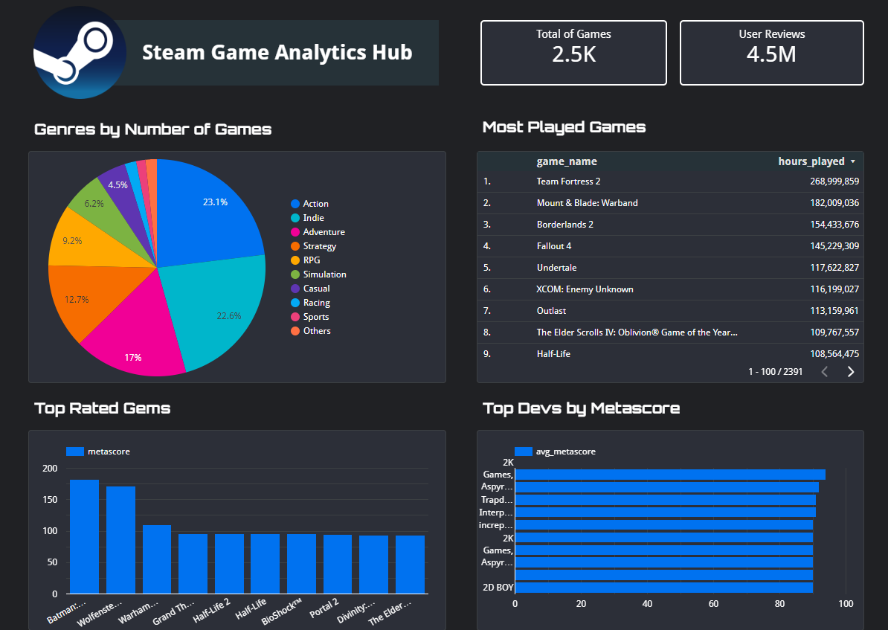

# Steam Data Engineering Project

## 🌟Overview
This project focuses on building an end-to-end data pipeline using Steam data, applying best practices in data engineering.

## 🚨Problem Description

Steam is a popular platform for video games, with a wealth of data related to games, reviews, and bundles. This project explores key insights from this data, such as:

* What are the most popular games?           
* Which developers have the highest-rated games?    
* What genres are the most common?    
* How do user reviews correlate with gameplay time?       

The goal is to create a streamlined pipeline that organizes the data, transforms it, and presents it through dashboards for easy analysis.

## 🚀Key Goals

* Develop a data pipeline to process Steam data in a structured manner.
* Build an analytical dashboard using Looker to visualize insights.

## 📁Dataset
The project utilizes the Steam Video Game and Bundle datasets, which were obtained from the [​University of California San Diego-Julian McAuley’ s Recommender Systems](http://cseweb.ucsd.edu/~jmcauley/datasets.html#steam_data). These datasets provide a comprehensive view of game data, including:

* Game information (title, developer, genre, etc.)
* User reviews and ratings
* Bundle details (grouped games)

The dataset includes fields such as:

* Game Title
* Developer
* Genre
* Metascore
* Review Text
* Hours Played

## ⚒️Technologies

    
    
    
    
    
    

## 🛠️Project Architecture
The end-to-end pipeline follows these steps:

* Data Extraction: Convert Steam data from JSON format to Parquet for efficient storage.
* Data Upload: Upload the Parquet files to Google Cloud Storage using Apache Airflow.
* Data Ingestion: Ingest the Parquet data into BigQuery.
* Data Transformation: Use dbt to transform and model the data into a star schema for analytics.
* Data Visualization: Use Looker to create interactive dashboards based on transformed data.
* Infrastructure Setup: Use Terraform to deploy and manage the GCP infrastructure.
  
More detailed information is provided in the diagram below:

The dashboard is created using Looker. The process for building such a dashboard in Looker is detailed in this tutorial.

The final dashboard includes the following charts:

* Total number of games
* Total number of users
* Most played games based 
* Genre distribution (pie chart)
* Best games based on Metascore (bar chart)
* Best developers based on Metascore

  

